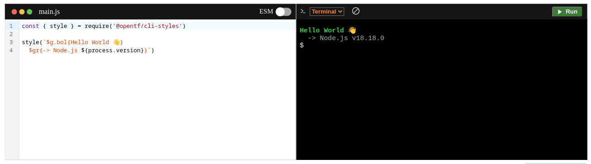

&nbsp;[OPEN TECH FOUNDATION](https://open-tech-foundation.pages.dev/)

<div align="center">

# React Node REPL



</div>

> The Node.js REPL in a React component.

# [Live Demo](https://node-repl.pages.dev/) | [Documentation](https://node-repl.pages.dev/docs)

## Features

- Simple API
- Powered by [WebContainer](https://webcontainers.io/)
- Install npm packages locally, directly in the terminal
- Switch between `Terminal` or `Console` View
- Keyboard shortcuts
- TypeScript support

## Upcoming

- Serialization of objects for better console view
- Code formating
- Syntax errors highlighting
- TypeScript errors

## Requirements

- Your site must be served over <strong>HTTPS</strong>.
- The following headers must be set in your deployed page.

```text
Cross-Origin-Embedder-Policy: require-corp
Cross-Origin-Opener-Policy: same-origin
```

<a href="https://webcontainers.io/guides/configuring-headers">
Learn more.
</a>

## Installation

```shell
npm install @opentf/react-node-repl
```

```shell
yarn add @opentf/react-node-repl
```

```shell
pnpm add @opentf/react-node-repl
```

```shell
bun add @opentf/react-node-repl
```

## Usage

```jsx
import { NodeREPL } from '@opentf/react-node-repl';
import '@opentf/react-node-repl/lib/style.css';

export default function App() {
  const code = `console.log("Hello World")`;
  const deps = ['pkg1', 'pkg2@1.2.3', 'pkg3@beta'];

  return <NodeREPL code={code} deps={deps} layout='SPLIT_PANEL' />;
}

```

## API

| Prop      | Type     | Required | Default   | Description                                                                                                      |
| --------- | -------- | -------- | --------- | ---------------------------------------------------------------------------------------------------------------- |
| code      | string   | No       | ""        | The main code to execute                                                                                         |
| deps      | string[] | No       | []        | The npm dependencies.Eg: ['lodash', 'chalk@4.1.2']                                                               |
| setupCode | string   | No       | ""        | The setup code, used to init some values. <br/>Eg: const log = console.log                                       |
| layout    | string   | No       | "DEFAULT" | The predefined layouts for the components.<br/>There are two types of layout: <br/>1. DEFAULT<br/>2. SPLIT_PANEL |

## Limitations

- Currently, it runs only Node.js v18
- By default, in REPL mode, you cannot use import statements. You need to fallback to require().
- You can run ESM modules manually in the terminal with the ESM switch on. Eg: `$ node main.js`
- It is not possible to run [native addons](https://nodejs.org/api/addons.html).

## License

Copyright (c) 2021, [Thanga Ganapathy](https://github.com/Thanga-Ganapathy) ([MIT License](./LICENSE)).
